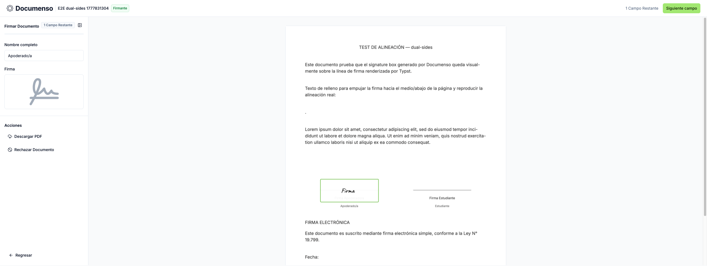

# Signature alignment fix — visual summary

**Date:** 2026-05-03
**Commit:** `da53f26`
**Fix:** Documenso signature field center now aligns with the rendered Typst signature line for all 13 layouts.

## Root cause

Two bugs combined to place signature fields well above their lines:

1. **Typst anchor at `dy: 20.0pt`** — the invisible anchor text was rendered 20pt below the block top (= 20pt below the `#line`), so pdftotext reported an inflated Y coordinate.
2. **Bottom-alignment formula** — `posY = anchorTopPct - height` placed the field *bottom* at the (already-wrong) anchor, putting the whole rectangle above the true line position.

## Fix

- `typst_converter_impl.go`: anchor moved to `dy: 0.0pt` — reports the exact line Y.
- `signature_position.go`: center-align formula — `posY = lineTopPct - height/2` — field center = line Y.

## dual-sides — baseline vs. final

### Baseline (before fix)

### Final (after fix)

**Observation:** In the baseline, both signature rectangles float clearly above their respective lines. In the final, both rectangles are centered on their lines.

---

## quad-grid — baseline vs. final

### Baseline (before fix)

### Final (after fix)

**Observation:** In the baseline, all four signature rectangles (2x2 grid) sit above their lines. In the final, all four are centered on their lines — including the second-row signatures which use a distinct anchor Y bucket (~299.82pt from bottom).

---

## All 13 layouts — numeric results

| Layout              | Numeric delta | Visual |
|---------------------|---------------|--------|
| single-left         | 0.000%        | PASS   |
| single-center       | 0.000%        | PASS   |
| single-right        | 0.000%        | PASS   |
| dual-sides          | 0.000%        | PASS   |
| dual-center         | 0.000%        | PASS   |
| dual-left           | 0.000%        | PASS   |
| dual-right          | 0.000%        | PASS   |
| triple-row          | 0.000%        | PASS   |
| triple-pyramid      | 0.000%        | PASS   |
| triple-inverted     | 0.000%        | PASS   |
| quad-grid           | 0.000%        | PASS   |
| quad-top-heavy      | 0.000%        | PASS   |
| quad-bottom-heavy   | 0.000%        | PASS   |

Metric: |center_pct - line_top_pct| < 0.5% where center_pct = positionY + height/2 and line_top_pct = 100 - (PDFPointY / PDFPageH) * 100.
